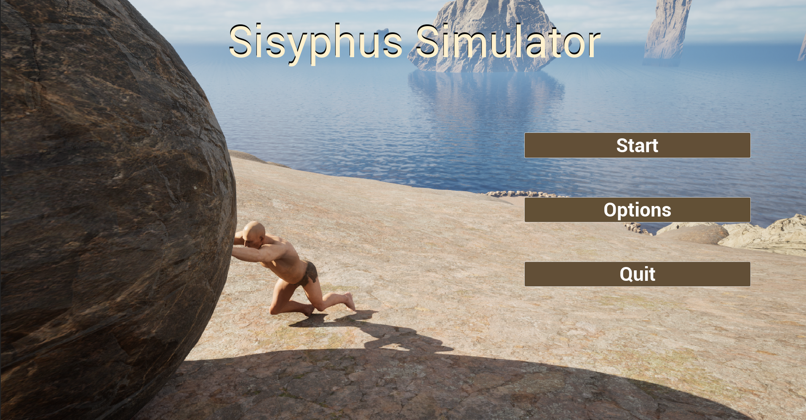
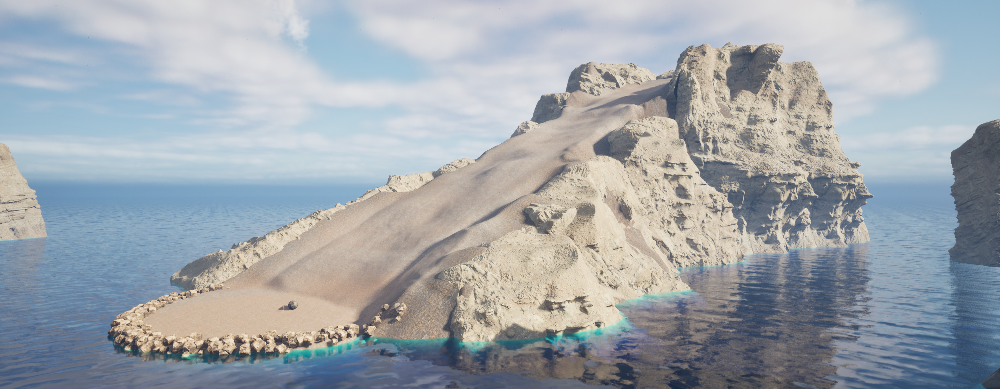

# Sisyphus Simulator

Sisyphus is a character from Greek mythology who was punished by the gods for his deceitfulness. He was condemned to endlessly push a boulder up a hill, only for it to roll back down every time he reached the top. This story is often used to illustrate the idea of never-ending, futile tasks.

## Description
This game was created using Unreal Engine 5. Step into the shoes of Sisyphus and simulate his punishment. The challenge of the game is to push the boulder.

## How to Play
It's very simple; your goal is to push the boulder to the top.

### Controls
- WASD and arrow keys for movement
- Spacebar to jump
- When you walk up to the boulder, the character automatically gets into a pushing position
- The esc key opens a pause menu

## About the Project
This project is my first endeavor in Unreal Engine. Inspired by the story of Sisyphus, I aimed to explore the concept through game development. I used this project to introduce myself to all the Unreal Engine software and how to code using the Blueprint system. I found this project to be very helpful.

## Preview

### - [Gameplay Demo Video](https://drive.google.com/file/d/1iLSOzoPfUDPcJv1Air1_rknpiHsYwKpI/view?usp=sharing)

|  |  |
|:--------------------------------:|:--------------------------------:|

|  |  |
|:--------------------------------:|:--------------------------------:|

## How to Play
Download and unzip the file, then run the application: [Google Drive](https://drive.google.com/file/d/1jHrTs4PYUg3vKsLuvpruK6-Hhdn_GN9l/view?usp=sharing)

## Issues
- Shadows are not showing up properly for the packaged game.

## Contact
If you have any questions, suggestions, or just want to connect, feel free to reach out to me:
- Email: areyanr@hotmail.com
